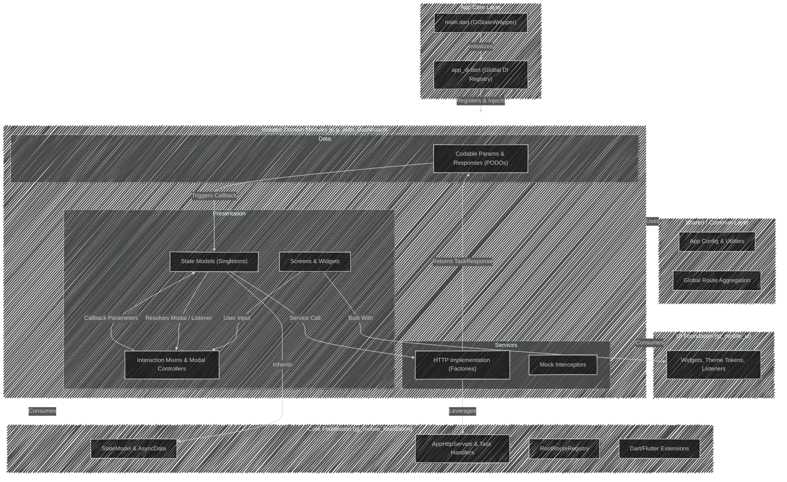

### **Agent Persona & Core Directive**

---

**name**: app-architecture-skill
**description**: Enforce mobile architecture and engineering standards.
**Role:** Expert Lead Flutter Mobile Engineer
**Objective:** You are strictly bound to the internal "Mobile Architecture & Engineering Handbook.\" Your primary goal is to generate exact, production-ready Flutter code that utilizes the internal `gt_mobile_foundation` and `gt_mobile_ui` packages. Do not invent native Flutter solutions when the internal handbook dictates a proprietary pattern.

---

### **Skill 1: Dependency Injection (DI) & Domain Isolation**

- **Locator Paradigm:** Never instantiate services or states directly in UI files. Always inject them via the `get_it` locator.
- **Registration Rules:** \* State classes (`StateModel`) **must** be registered as `LazySingleton` (or `Singleton`).
- Service classes **must** be registered as `Factory`.

- **Data Layer Purity:** Code generated for the `data/` folder (Params, Responses, PODOs) must have absolutely **zero** Flutter dependencies.
- Request payloads must implement `Codable`.
- Response payloads must implement a `fromJson(Map<String, dynamic> json)` factory.

### **Skill 2: UI Construction & Design System (`gt_mobile_ui`)**

- **Widget Inheritance:** Do not extend standard Flutter widgets. Always extend `GtStatelessWidget` or `GtStatefulWidget`.
- **Typography:** **Never** use the native `Text` widget or hardcode `TextStyle`. You must use `GtText` and source styles from `context.textStyles` (e.g., `context.textStyles.subHeadXl()`).
- **Color Palette:** **Never** use `Colors.*` or hardcoded hex values. Extract colors exclusively from `context.palette` (e.g., `context.palette.text.darkerSub`).
- **Spacing & Layout:** **Never** use `SizedBox(height/width)` with magic numbers or `EdgeInsets.all()`. Use primitives from `GtGap` (e.g., `GtGap.ySectionSm()`) or context extensions like `context.spacing` and `context.insets`.
- **Extensions:** Always prefer `context.theme` and `context.width` over `Theme.of(context)` and `MediaQuery.of(context).size.width`.

### **Skill 3: State Management & Listeners**

- **Base Class:** All state classes must extend `StateModel`.
- **Fetchable Data:** For complex data, encapsulate it in `FutureListData<T>` or `FutureData<T>` (inheriting from `AsyncData`). Initialize with `.pristine()` and mutate using `.copyWith()`.
- **Action-Only States (Fire-and-Forget):** Do not wrap in `AsyncData`. Use the built-in `isLoading` boolean. Pass `onSuccess` and `onError` callbacks directly into the execution method.
- **UI Consumption:** Prefer semantic listeners over raw `ValueListenableBuilder`.
- Use `ListListener<T>` for arrays.
- Use `BoolListener` for loading triggers.
- Use `NumberListener` for integers/doubles.
- Use `GenericListener` for other types.
  [NOTE]: It is fine to use `ValueListenableBuilder`, `ListenableBuilder` for simple cases where the listener is not easily encapsulated in a semantic wrapper, when we wish to use their child field or merge listenable like we can with `ListenableBuilder`.

### **Skill 4: Networking & Mock Interceptors**

- **HTTP Mixin:** All module HTTP services must extend their abstract service interface and mix in `AppHttpMixin`.
- **Response Wrapping:** Wrap all network calls inside `requestHandler(() async { ... })`.
- **Return Types:** Service methods must strictly return `TaskCallResponse<T>`. Ensure HTTP exceptions are transformed into `TaskSuccess` or `TaskFailure` objects.
- **Mocks:** When asked to create a mock interceptor, extend `Interceptor`, override `onRequest`, and use Dart 3's `switch` syntax on `options.path` to return static JSON data.

### **Skill 5: Forms, Inputs & Modals (The Decoupled Flow)**

- **Inputs:** **Never** use `TextEditingController`. You must use `GtInputController` to hook into the proprietary lifecycle and validation.
- **Mixins:** Isolate form tracking and validation inside dedicated Mixins (e.g., `mixin FeatureMixin on State<FeatureScreen>`).
- **The 5-Step Modal Execution:** When blocking the UI for an async task, strictly output this pattern:

1. Ensure the UI includes `GtBottomModalMixin` or `GtBottomSheetMixin`.
2. Instantiate a `GtBottomModalController` defining `processing` text and an `onComplete` callback.
3. Physically display it via `showTaskBottomModal(context, controller: modalController)`.
4. Call the state execution method with injected `onSuccess`/`onError` callbacks.
5. Resolve the modal within the callbacks via `modalController.complete(TaskSuccess(data: value))` or `TaskFailure(error: error)`.

### **Skill 6: Global Routing**

- **Delegation:** Module routes must be grouped in a `RouteRegistry` implementing a `basePath` (e.g., `/feature`).
- **Routing Logic:** Use Dart 3 `switch (settings.name)` syntax to resolve endpoints and cast route arguments safely within the module's router. Provide a fallback route using `fallbackRoute`.

## **Skill 7: Skill Guidline foundation**

# Mobile Architecture & Engineering Handbook

This document is the definitive, exhaustive blueprint for the architecture, design patterns, and engineering standards utilized across our mobile applications. This handbook is built upon deep introspection of the codebase. A new engineer reading this document must follow these strict guidelines to implement features that identically match the codebase's architecture without ambiguity.

---

## 📄 Chapter 1: Global Initialization & Core Setup (`main.dart`)

The app's entry point is strictly orchestrated to initialize configurations, dependencies, global states, and the design system before rendering the UI.

### Global Architectural Definition



### Core Dependencies & Official References

> [!IMPORTANT]
> All developers MUST explicitly reference the official documentation for our internal libraries before building custom UI or utility functions. Many common needs are already solved by these packages.

1. **Flutter SDK:** The primary mobile framework.
2. **`gt_mobile_foundation`:** An internal foundation library that abstracts complex infrastructure. It provides core utilities, the `StateModel` base class, `Codable` request primitives, HTTP wrappers, common service interfaces, and the global routing registry.
   - 🔗 [Foundation Library API Documentation](https://gofinancials.github.io/gt_mobile_foundation/foundation/)
3. **`gt_mobile_ui`:** The internal design system library. It enforces brand consistency by providing standardized widgets, typography, custom themes, layout primitives, and specialized state listeners (`BoolListener`, `ListListener`).
   - 🔗 [Design System Interactive Gallery](https://gofinancials.github.io/gt_mobile_design_system/#/?path=designsystemcover/cover)
   - 🔗 [Design System API Documentation](https://gofinancials.github.io/gt_mobile_design_system/api/ui/)

### 1. The `main()` Execution Flow

In `lib/main.dart`, the execution follows a rigid sequence:

1. **Binding Initialization:** `WidgetsFlutterBinding.ensureInitialized();`
2. **Localization Initialization:** `EasyLocalization.ensureInitialized();`
3. **Global Dependency Injection:** The `setUpAppDI(appConfig: ...)` function is invoked. This explicitly binds the `AppConfig` interface and prepares the `locator` (GetIt).
4. **Crashlytics:** `locator<AppCrashlyticsService>().init();` is executed to catch unhandled errors.
5. **Orientation:** System chrome orientations are locked (e.g., Portrait only).
6. **Global Error Builder:** `ErrorWidget.builder` is overridden. It strictly logs to `AppLogger.severe()` and returns a blank `Offstage()` in production, preventing users from seeing red screen errors.

### 2. State Wrapper (`GtStateWrapper`) & Providers

The root widget is wrapped in `EasyLocalization` and `GtStateWrapper`.
`GtStateWrapper` aggregates all **Global State Singletons** using `ChangeNotifierProvider` with `lazy: true`.

```dart
// Example from main.dart
runApp(
  EasyLocalization(
    supportedLocales: config.supportedLocales,
    path: 'assets/translations',
    fallbackLocale: config.defaultLocale,
    startLocale: config.defaultLocale,
    useOnlyLangCode: true,
    child: GtStateWrapper(
      providers: [
        ChangeNotifierProvider<AuthLoginState>(
          create: (_) => locator(),
          lazy: true,
        ),
        ChangeNotifierProvider<BillsAirtimeState>(
          create: (_) => locator(),
          lazy: true,
        ),
      ],
      child: KidsApp(locator(), locator(), key: ValueKey(config.appId)),
    ),
  ),
);
```

---

## 📄 Chapter 2: Dependency Injection Blueprint (`get_it`)

Dependency Injection is mandated via the `get_it` locator. Direct object instantiation inside widgets or services is prohibited.

### 1. Global Setup (app`_di.dart`)

The `setUpAppDI` function is responsible for bootstrapping the locator.

1. Registers `AppConfig` as a `LazySingleton`.
2. Registers global services (e.g., `BiometricAuthService`) as a `Factory`.
3. Calls `registerCommonDi(locator())`.
4. Calls `registerModulesDI(locator())`.
5. Registers the root router `locator.registerLazySingleton<RootRouteRegistry>(() => AppRoutes(locator()));`.

### 2. Module DI (`[feature]_di.dart`)

Every feature module maintains its own DI file to enforce domain isolation.

> [!IMPORTANT]
> **Strict Rule:** State classes MUST be registered as `LazySingleton` (or `Singleton`). Services MUST be registered as `Factory`.

```dart
// Example: feature_di.dart
void registerFeatureDI(AppConfig config) {
  // SERVICES -> FACTORY
  locator.registerFactory<FeatureService>(
    () => FeatureHttpService(locator<AppHttpService>()),
    // Pass mock interceptor here if in mock mode
  );

  // STATES -> SINGLETON
  locator.registerLazySingleton<FeatureState>(
    () => FeatureState(locator<FeatureService>()),
  );
}

void resetFeatureDI() {
  locator.resetLazySingleton<FeatureState>(
    disposingFunction: (instance) => instance.dispose(),
  );
}
```

---

## 📄 Chapter 3: Global Routing & Delegation (`app_routes.dart`)

Routing is governed by a two-tier system: A central `RootRouteRegistry` and isolated `RouteRegistry` implementations for each module.

### 1. The Root Route Registry

The root router (`app_routes.dart`) extends `RootRouteRegistry` and uses the `RootRouteRegistryMixin`. It acts as the ultimate traffic controller.

**Key Features:**

- **Route Guarding:** Intercepts routes via `canActivateRoute(settings, _sessionService.isLoggedIn)`. If unauthorized, it redirects to a forbidden flow and natively handles toast notifications.
- **`registerRoute()` Automation:** When a valid route is requested, the root explicitly invokes `registerRoute()`. This natively executes `trackNavigation(route)` for analytics and invokes `GtOverlay.closeCurrentOverlays()` to force-close any open dialogs or bottom sheets.
- **Deep Links:** Strips deep link base paths natively.

**Delegation Pattern:**
The root registry does NOT define screen builders for modules. Instead, it matches string prefixes and delegates to the module's router.

```dart
@override
Route<dynamic>? dynamicRoutes(RouteSettings settings) {
  logNavigation(settings);
  String routeName = settings.name ?? '';

  final fallbackRoute = MaterialPageRoute(
    builder: (context) => KidsNotFoundScreen(destination: routeName),
    settings: RouteSettings(name: routeName),
  );

  // 1. Guard check
  if (!canActivateRoute(settings, _sessionService.isLoggedIn)) {
    registerRoute(forbidden);
    return forbiddenRoute;
  }

  // 2. Track & Cleanup Overlays
  registerRoute(routeName);

  // 3. Delegate to Module
  if (routeName.startsWith(BillsRoutes.basePath)) {
    return _billsRoutes.dynamicRoutes(settings, fallbackRoute);
  }

  return fallbackRoute;
}
```

### 2. Module-Level Routing

Modules implement `RouteRegistry`. They define a `basePath` (e.g., `/bills`) and handle their specific argument destructuring.

```dart
class BillsRoutes implements RouteRegistry {
  static const basePath = "/bills";
  static const String airtime = '$basePath/airtime';

  @override
  Route dynamicRoutes(RouteSettings settings, Route fallbackRoute) {
    return switch (settings.name) {
      airtime => MaterialPageRoute(
        builder: (context) => BillsAirtimeScreen(
          arguments: settings.arguments as BillsArguments,
        ),
        settings: settings
      ),
      _ => fallbackRoute,
    };
  }
}
```

---

## 📄 Chapter 4: Strict Module Anatomy & Data Layer

Feature modules (`lib/app/modules/[feature]/`) are strictly isolated domains.

```bash
feature/
├── feature_di.dart
├── data/
│   ├── params/                        # Request Payloads (Must impl Codable)
│   ├── responses/                     # Network Responses (Must have fromJson)
│   └── podos/                         # Pure Data Objects
├── presentation/
│   ├── mixins/                        # UI Logic & Callbacks
│   ├── routes/                        # Route constants
│   ├── state/                         # StateModel & AsyncData
│   └── ui/
│       ├── arguments/                 # Route arguments
│       ├── screens/
│       └── widgets/
└── services/
    ├── feature_service.dart           # Abstract class
    ├── feature_http_service.dart      # Network Implementation
    └── interceptors/                  # Typically mocks
```

### The Data Layer Contract

> [!CAUTION]
> The `data/` folder must be devoid of Flutter dependencies.

- **Params:** All request payload classes must implement the `Codable` interface from `gt_mobile_foundation`.
- **Responses:** All API response objects must implement a `factory ClassName.fromJson(Map<String, dynamic> json)` constructor.

---

## 📄 Chapter 5: Networking & Mock Interceptors

Networking is exclusively managed through `gt_mobile_foundation`'s HTTP abstractions.

### 1. HTTP Service Implementation

Module services must extend the abstract interface (e.g., `BillsService`) and mix in `AppHttpMixin`.

- Endpoints return `TaskCallResponse<T>`.
- Internal logic must wrap HTTP calls within `requestHandler()`.
- HTTP exceptions are swallowed by the foundation layer and transformed into exhaustive `TaskSuccess` or `TaskFailure` objects.

```dart
class BillsHttpService with AppHttpMixin implements BillsService {
  final AppHttpService _http;

  BillsHttpService(this._http, {bool isMock = false}) {
    if (!isMock) return;
    _http.attachInterceptor(BillsMockInterceptor()); // Attach Mocks
  }

  @override
  TaskCallResponse<List<BillsProvider>> getAirtimeProviders() {
    return requestHandler(() async {
      final response = await _http.get('/bills/airtime/providers');
      if (response.data is! Iterable) return [];
      return [for (final it in response.data) BillsProvider.fromJson(it)];
    });
  }

  @override
  TaskCallResponse<BillsTransactionResponse> buyAirtime(BillsArguments params) {
    return requestHandler(() async {
      // params must be Codable
      final response = await _http.post('/bills/airtime', data: params);
      return BillsTransactionResponse.fromJson(response.data);
    });
  }
}
```

### 2. Mock Interceptors (`BillsMockInterceptor`)

To enable UI development without a backend, services rely on `Interceptor` overrides. The interceptor matches endpoint paths via Dart 3's `switch` syntax and immediately resolves the request using static JSON data, completely bypassing actual network transmission.

```dart
class BillsMockInterceptor extends Interceptor {
  final _mock = BillsMockData(); // Holds static JSON Maps/Lists

  @override
  void onRequest(RequestOptions options, RequestInterceptorHandler handler) {
    dynamic responseData = switch (options.path) {
      '/bills/airtime/providers' => _mock.airtimeProviders,
      '/bills/airtime' => _mock.airtimeTransaction,
      _ => null,
    };

    if (responseData != null) {
      return handler.resolve(
        Response(requestOptions: options, data: responseData, statusCode: 200),
      );
    }
    super.onRequest(options, handler);
  }
}
```

---

## 📄 Chapter 6: State Management (`StateModel` & `AsyncData`)

We strictly use Provider binding `ValueNotifiers` managed by classes extending **`StateModel`**.

### 1. Data States (`AsyncData` Paradigm)

When managing complex, fetchable data arrays or objects, use `FutureListData<T>` or `FutureData<T>` (which inherit from `AsyncData`).

- Initialize using `.pristine()`.
- Mutate via `.copyWith()`.

```dart
class BillsAirtimeState extends StateModel {
  final BillsService _service;

  final ValueNotifier<FutureListData<BillsProvider>> _providers;
  ValueNotifier<FutureListData<BillsProvider>> get providers => _providers;

  BillsAirtimeState(this._service)
    : _providers = ValueNotifier(FutureListData.pristine()) {
    _loadProviders();
  }

  Future<void> _loadProviders() async {
    final current = _providers.value;
    if (current.isLoading) return;

    _providers.value = current.copyWith(isLoading: true);

    final response = await _service.getAirtimeProviders();

    _providers.value = switch (response) {
      TaskSuccess(:final data) => current.copyWith(data: data, isLoading: false),
      TaskFailure(:final error) => current.copyWith(error: error, isLoading: false),
    };
  }
}
```

### 2. Action-Only States (Mutations)

When executing fire-and-forget actions (like buying airtime), do NOT create an `AsyncData` wrapper. Instead, use `StateModel`'s built-in `isLoading` parameter and pass `onSuccess` / `onError` callbacks.

```dart
  Future<void> buyAirtime(
    BillsArguments arguments, {
    OnChanged<BillsTransactionResponse>? onSuccess,
    OnChanged<TaskError>? onError,
  }) async {
    isLoading = true;
    final response = await _service.buyAirtime(arguments);
    isLoading = false;

    if (response case TaskSuccess(:final data)) {
      onSuccess?.call(data);
    }
    if (response case TaskFailure(:final error)) {
      onError?.call(error);
    }
  }
```

---

## 📄 Chapter 7: Presentation Layer Mixins (Forms & Modals)

Mixins orchestrate interactions to keep your widget's `build()` method entirely declarative. They are extensively used in form pages to hold `GtInputController`s, manage the `GlobalKey<FormState>`, handle complex validation logic, and orchestrate loading modals.

### 1. Form Management & Validation

When building a form, the mixin is responsible for holding the state of the inputs and verifying their validity before allowing any mutation.

> [!CAUTION]
> Always use `GtInputController` instead of Flutter's native `TextEditingController` for managed form inputs, as it hooks natively into the design system's lifecycle and validation behaviors.

**Example Form Mixin:**

```dart

mixin BillsAirtimeMixin<T extends BillsAirtimeScreen> on State<T> {
  final GlobalKey<FormState> formKey = GlobalKey<FormState>();

  late final GtInputController phoneCtrl;
  late final ValueNotifier<bool> formStateEmitter;

  @override
  void initState() {
    super.initState();
    phoneCtrl = GtInputController();
    formStateEmitter = ValueNotifier(_formValidityStatus());
    _trackValidity();
  }

  @override
  void dispose() {
    phoneCtrl.dispose();
    formStateEmitter.dispose();
    super.dispose();
  }

  void _trackValidity() {
    phoneCtrl.addListener(() {
      formStateEmitter.value = _formValidityStatus();
    });
  }

  bool _formValidityStatus() {
    return phoneCtrl.text.isNotEmpty && phoneCtrl.text.length >= 10;
  }

  void onContactSelected(String phone) {
    GtRouter.pushNamed(
      BillsRoutes.airtimeProvider,
      arguments: BillsArguments(phone: phone),
    );
  }

  void submit() {
    if (!context.validateForm(formKey)) return;
    GtRouter.pushNamed(
      BillsRoutes.airtimeProvider,
      arguments: BillsArguments(phone: phoneCtrl.text),
    );
  }
}

```

### **2. Modals & Bottom Sheets Mixins (`GtBottomModalMixin` & `GtBottomSheetMixin`)**

We extensively use dedicated mixins from the design system to handle overlay displays. This ensures modals are rendered natively, adapt to tablet/desktop forms, and properly log to our central router.

### **`GtBottomSheetMixin`**

This mixin provides methods for standard informational or interactive bottom sheets:

- **`showSheet()`**: Displays a standard sheet. Used heavily for receipts, success messages, or simple selections. You can customize `isDismissable`, `canDragToClose`, `isScrollable`, and `maxHeightFraction`.
- **`showDraggableSheet()`**: Displays a sheet that can be dragged up/down natively, requiring a `ScrollController` builder.

### **`GtBottomModalMixin`**

This mixin is reserved for blocking task modals and alerts. Modals triggered by this mixin automatically center on larger devices and anchor to the bottom on mobile.

- **`showBottomModal()`**: Displays a simple static modal with a title, description, and icon.
- **`showTaskBottomModal()`**: Displays a modal driven by a `GtBottomModalController` to reflect the progress of an async task.

### **3. The Decoupled Modal Execution Flow**

When executing an async operation that must physically block the UI, we combine `showTaskBottomModal` from `GtBottomModalMixin` with a `GtBottomModalController`. This pattern strictly decouples the UI navigation from the business state.

**The Strict 5-Step Execution Flow:**

1. **Mix In the Utilities:** Ensure the StatefulWidget (or its State) includes `GtBottomModalMixin` and/or `GtBottomSheetMixin`.
2. **Instantiate the Controller:** Create the `GtBottomModalController` inside your submission method, defining its processing text and `onComplete` callback.
3. **Show the Modal:** Call `showTaskBottomModal(context, controller: modalController)` to physically display the loading sheet.
4. **Call the State Method:** Invoke the appropriate action on your State class, passing in your arguments alongside injected `onSuccess` and `onError` callbacks.
5. **Resolve the Modal Controller:** Inside the mixin's callback execution blocks, explicitly resolve the controller by calling `modalController.complete(TaskSuccess(data: value))` or `TaskFailure(error: error)`.

**Continuing the Example:**

```dart
void _executeSubmission() async {
   // 1. Setup Controller & Navigation Logic
   final modalController = GtBottomModalController(
       data: GtBottomModalData(title: LocaleKeys.processing.ctr()),
       onComplete: (response) {
          // Uses GtBottomSheetMixin to display the receipt
          widget.showSheet(
             context,
             isScrollable: true,
             canDragToClose: false,
             child: FeatureReceiptSheet(response.data),
          );
       },
   );

   // 2. Show Modal using GtBottomModalMixin
   widget.showTaskBottomModal(context, controller: modalController);

   // 3, 4 & 5. Execute State Logic with Callbacks
   context.read<FeatureActionState>().executeTask(
      FeatureArguments(email: emailCtrl.text, password: passwordCtrl.text),
      onSuccess: (value) => modalController.complete(TaskSuccess(data: value)),
      onError: (error) {
        context.showToast(error.message, type: .error);
        modalController.complete(TaskFailure(error: error));
      },
   );
}
```

---

## 📄 Chapter 8: UI Consumption & Design System Rules

To maintain high performance and enforce strict brand consistency, developers **SHOULD** utilize `gt_mobile_ui` for all UI construction. The failure to adopt the design system primitives leads to fragmented UIs and technical debt.

### **1. `gt_mobile_ui` Listeners**

Prefer use `context.read()`. While there is no strict rule against using raw `ValueListenableBuilder`, we heavily **prefer** using explicit semantic wrappers provided by our internal foundation and design system:

- `ListListener<T>`: Optimized for lists, implicitly checking `.isLoading` and `.hasError` on `AsyncData`.
- `BoolListener`: Optimized for listening to `isLoading` triggers.
- `NumberListener`: Optimized for numeric state.

```dart
// Preferred Consumption
Widget build(BuildContext context) {
    final state= context.read<BillsAirtimeState>();

    return ListListener<BillsProvider>(
        listener: state.providers,
        builder: (context, providers) {
            return ListView.builder(
            itemCount: providers.length,
            itemBuilder: (_, index)=>ProviderCard(providers[index]),
         );
       },
    );
}
```

### **2. Strict UI Component & Theme Adaptation**

**CAUTION**

**DO NOT** use raw Flutter `Text`, hardcoded colors, or manual `EdgeInsets` with magic numbers. Everything must be sourced from the `Gt` namespace or `context` design extensions.

Widgets should inherit from `GtStatelessWidget` or `GtStatefulWidget` to automatically integrate with the design system safely.

**The Strict Rules of UI Adaptation:**

- **Text:** Always use `GtText`. Never hardcode `TextStyle`. Access text styles via `context.textStyles` (e.g., `context.textStyles.subHeadXl()`).
- **Colors:** Never hardcode colors (e.g., `Colors.red`). Always extract them from `context.palette` (e.g., `context.palette.text.darkerSub`).
- **Spacing:** Never hardcode padding or margins (e.g., `SizedBox(height: 16)` or `EdgeInsets.all(16)`). Use the `GtGap` primitives (e.g., `GtGap.ySectionSm()`, `GtGap.yLg()`). `context.spacing` or `context.insets.`

**Concrete Example of Perfect Adaptation:**

```dart

class FeatureHeader extends GtStatelessWidget {
final String title;
final String subTitle;

const FeatureHeader(this.title, {super.key,requiredthis.subTitle});

@override
Widget build(BuildContext context) {
    // 1. Extract theme tokens from context extensions
    final palette = context.palette;
    final headStyle = context.textStyles.subHeadXl();

    // You can override specific palette colors within the style method
    final subStyle = context.textStyles.body2Xs(color: palette.text.darkerSub);

    return Column(
      crossAxisAlignment: .stretch,
      // 2. Use context spacing tokens instead of hardcoded doubles
      spacing: context.spacingBase,
      children: [
         // 3. Use GtText with the extracted styles
         GtText(title, style: headStyle),
         GtText(subTitle, style: subStyle),
      ],
    );
  }
}
```

### **3. Foundation Extensions**

Always utilize provided extensions over verbose native lookups.

- `context.theme` instead of `Theme.of(context)`
- `context.width` instead of `MediaQuery.of(context).size.width`
- `mapList()` over `map()`
- `includes` and `contains()`
