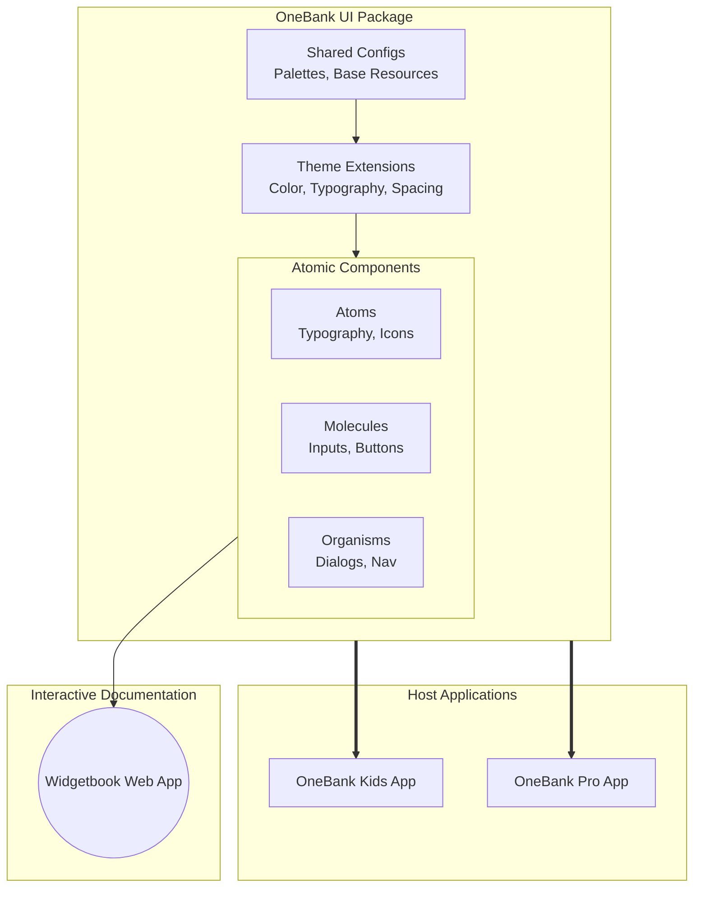

## 1. Project Vision & Business Value

As the OneBank ecosystem expands to include applications like "OneBank Kids" alongside the primary banking applications, maintaining UI consistency, development velocity, and brand identity becomes increasingly complex.

The **OneBank UI Design System** will serve as a centralized, standalone Flutter package containing all reusable UI components.

**Key Business Benefits:**

- **Accelerated Time-to-Market:** Engineers will assemble screens using pre-built, tested components rather than rewriting UI logic for every new app.
- **Dynamic Multi-App Theming:** Through advanced theming engines, a single "Button" component can automatically render in "OneBank Kids" colors or "OneBank Primary" colors simply by changing the app's configuration.
- **Unified Brand Identity:** Ensures consistent typography, spacing, and interaction patterns across all digital touchpoints.
- **Interactive Catalog (Widgetbook):** We are using Widgetbook specifically because it is purpose-built for Flutter. It allows us to deploy a native, web-based catalog where designers, PMs, and QA can interact with components in isolation before they are integrated into the actual apps.

## 2. Phased Execution Strategy (3-Week Timeline)

To meet aggressive delivery targets, we will execute this project in four highly focused sprints spanning exactly 3 weeks.

### Phase 1: Infrastructure & Theming Foundation (Week 1, Days 1-2)

- **Objective:** Establish the standalone Flutter package repository, configure shared resources, and implement the core theming engine.
- **Key Deliverables:** Implementation of Flutter `ThemeExtension` to handle light/dark mode and multi-app color palettes, establishment of shared configuration classes, and local integration of the `Widgetbook` environment.

### Phase 2: Core Primitives (Atoms & Molecules) (Week 1 - Week 2)

- **Objective:** Migrate and standardize the smallest building blocks from our existing codebase.
- **Key Deliverables:** Typography engines, color tokens, buttons, form inputs, icons, and basic indicators. Each will be documented in Widgetbook with interactive controls (knobs) to test states (e.g., disabled, loading).

### Phase 3: Complex Components (Organisms & Layouts) (Week 2 - Week 3)

- **Objective:** Combine primitives into complex, functional UI components.
- **Key Deliverables:** App bars, navigation components, dialogs, bottom sheets, form layouts, and view states (empty/error/loading screens).

### Phase 4: Integration & Documentation (Week 3, Days 4-5)

- **Objective:** Finalize the library for consumption by the OneBank Kids application.
- **Key Deliverables:** Version 1.0.0 release of the internal package, deployment of the hosted Widgetbook web URL for stakeholders, and integration guides for the engineering team.

This document outlines the architectural blueprint for the OneBank UI Component Library. It details our approach to dynamic theming, the mapping of our folder structure to Atomic Design principles, and the integration of our interactive component catalog.

## 1. Architectural Philosophy: Loose Atomic Design

To ensure scalability and reusability, we loosely adopt the **Atomic Design** methodology, mapped conceptually to our established Flutter directory conventions:

- **Atoms (Primitives):** The absolute basics. These cannot be broken down further. (e.g., `typography/`, `icons/`, `spacers/`, `style/colors.dart`).
- **Molecules (Fragments):** Simple UI components built by combining atoms. (e.g., `fragments/buttons/`, `inputs/`, `pills/`).
- **Organisms (Complex Components):** Distinct sections of an interface combining molecules and atoms. (e.g., `layouts/app_bars/`, `dialogs/`, `modals/`).
- **Templates (Layouts & States):** Page-level structures that dictate where organisms sit without injecting business data. (e.g., `layouts/view_state/`, `layouts/containers/`).

## 2. Dynamic Theming Engine (ThemeExtensions)

To achieve true dynamic theming across different OneBank applications (and support light/dark modes natively), we strictly avoid hardcoding colors. Instead, we leverage Flutter's `ThemeExtension` API powered by shared configuration resources.

This allows us to inject custom, strongly-typed semantic color tokens into the Flutter context, enabling an app like "OneBank Kids" to inject its playful palette, while the main app injects a corporate palette.

```dart
// 1. Define the Extension
class AppColorsExtension extends ThemeExtension<AppColorsExtension> {
  final Color primaryAction;
  final Color surfaceBackground;
  final Color textInteractive;

  const AppColorsExtension({
    required this.primaryAction,
    required this.surfaceBackground,
    required this.textInteractive,
  });

  @override
  ThemeExtension<AppColorsExtension> copyWith({...}) { ... }

  @override
  ThemeExtension<AppColorsExtension> lerp(...) { ... }
}

// 2. Define App-Specific Palettes utilizing shared configurations
final kidsLightColors = AppColorsExtension(
  primaryAction: OneBankSharedColors.playfulOrange,
  surfaceBackground: OneBankSharedColors.neutralLight,
  textInteractive: OneBankSharedColors.kidsBlue,
);

final mainBankLightColors = AppColorsExtension(
  primaryAction: OneBankSharedColors.corporateBlue,
  surfaceBackground: OneBankSharedColors.white,
  textInteractive: OneBankSharedColors.black,
);
```

## 3. Architecture Diagram

The following diagram illustrates how the `OneBank UI` library is consumed by host applications, and how `Widgetbook` acts as an isolated preview environment.



## 4. Directory Structure

We maintain our proven directory structure, explicitly categorizing folders by their conceptual atomic weight. We have introduced a `config/` directory specifically to account for commonly shared classes and resources that govern theme generation.

```
.
├── assets/                  # Centralized static assets (fonts, universal SVGs)
├── config/                  # [SHARED RESOURCES] Theme generation & constants
│   ├── color_palettes.dart  # Raw hex colors (e.g., OneBankSharedColors)
│   ├── spacing_config.dart  # Base padding/margin definitions
│   └── typography_config.dart# Font family names and base sizes
├── mixins/                  # Reusable UI logic (e.g., system chrome management)
├── painter/                 # Custom canvas painters (dashed lines, progress rings)
├── physics/                 # Custom scroll physics (e.g., marquee scrolling)
├── state/                   # UI-only state wrappers (NO business logic)
├── style/                   # [THEME ENGINE]
│   ├── colors.dart          # Semantic color mappings
│   ├── input_styles.dart    # Base field decorations
│   ├── text_styles.dart     # Semantic text definitions
│   └── theme/
│       ├── theme.dart       # Core theme interface
│       └── tr_theme.dart    # ThemeExtension implementations
├── widgets/                 # [COMPONENT LIBRARY]
│   ├── animation/           # Shimmers, implicit animations
│   ├── fragments/           # [ATOMS & MOLECULES]
│   │   ├── buttons/         # AppButton, IconButton, TextButton
│   │   ├── cards/           # Base card containers
│   │   ├── images/          # Svg, Lottie, NetworkImage wrappers
│   │   ├── indicators/      # Checkboxes, switches, progress bars
│   │   ├── inputs/          # TextFields, Dropdowns, Date inputs
│   │   ├── list_items/      # Standardized list tiles
│   │   ├── pills/           # Tags, badges, status pills
│   │   ├── spacers/         # Gaps, dividers, specific sized boxes
│   │   ├── text/            # Specialized text widgets (terms, gilded headers)
│   ├── icons/               # Icon containers and mappings
│   ├── layouts/             # [ORGANISMS & TEMPLATES]
│   │   ├── app_bars/        # Standard and segmented app bars
│   │   ├── containers/      # Max width, responsive bounds
│   │   ├── dialogs/         # Confirmation, info, error dialogs
│   │   ├── forms/           # Form wrappers and auto-validators
│   │   ├── view_state/      # Empty, Loading, and Error state templates
│   ├── media/               # Audio/Video player UI controls
│   ├── modals/              # Bottom sheets and modal bodies
│   ├── overlays/            # Tooltips, disabled states, floating notifications
│   ├── typography/          # [ATOMS] Base text definitions (H1, Body, Label)
└── widgetbook/              # Widgetbook setup, use-cases, and story files
```

## 5. Tooling: Widgetbook Integration

We selected **Widgetbook** specifically because it is built natively for Flutter environments. Unlike generic component libraries, Widgetbook runs seamlessly within our existing Dart tooling, ensuring identical rendering behavior between the documentation and the live app.

- **Use Cases:** Every component in the `widgets/` directory MUST have a corresponding `.usecase.dart` file.
- **Knobs:** Engineers must implement "Knobs" (booleans, text inputs, sliders) in the Widgetbook definitions so PMs and Designers can dynamically alter component states (e.g., toggling an `isLoading` knob on an `AppButton`).
- **Deployment:** The Widgetbook will be compiled to a Flutter Web app and deployed for internal stakeholder review.

@Isma'il @Bolanle Tyson