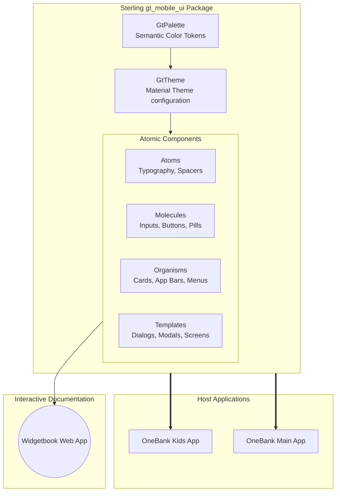

## 1. Project Vision & Business Value

As the OneBank ecosystem expands to include applications like "OneBank Kids" alongside the primary banking applications, maintaining UI consistency, development velocity, and brand identity becomes increasingly complex.

The **OneBank UI Design System** will serve as a centralized, standalone Flutter package containing all reusable UI components.

**Key Business Benefits:**

- **Accelerated Time-to-Market:** Engineers will assemble screens using pre-built, tested components rather than rewriting UI logic for every new app.
- **Dynamic Multi-App Theming:** Through advanced theming engines, a single "Button" component can automatically render in "OneBank Kids" colors or "OneBank Primary" colors simply by changing the app's configuration.
- **Unified Brand Identity:** Ensures consistent typography, spacing, and interaction patterns across all digital touchpoints.
- **Interactive Catalog (Widgetbook):** We are using Widgetbook specifically because it is purpose-built for Flutter. It allows us to deploy a native, web-based catalog where designers, PMs, and QA can interact with components in isolation before they are integrated into the actual apps.to Atomic Design principles, and the integration of our interactive component catalog.

## 1. Architectural Philosophy: Loose Atomic Design

To ensure scalability and reusability, we loosely adopt the **Atomic Design** methodology, mapped conceptually to our established Flutter directory conventions:

- **Atoms (Primitives):** The absolute basics. These cannot be broken down further. (e.g., `typography/`, `media/`, `spacers/`).
- **Molecules (Fragments):** Simple UI components built by combining atoms. (e.g., `buttons/`, `inputs/`, `pills/`).
- **Organisms (Complex Components):** Distinct sections of an interface combining molecules and atoms. (e.g., `app_bars/`, `cards/`, `navigation/`).
- **Templates (Layouts & States):** Page-level structures that dictate where organisms sit without injecting business data. (e.g., `dialogs/`, `modals/`, `screens/`).

## 2. Dynamic Theming Engine (ThemeExtensions)

To achieve true dynamic theming across different OneBank applications (and support light/dark modes natively), we strictly avoid hardcoding colors. Instead, we leverage Flutter's `ThemeExtension` API powered by our own `GtTheme` and `GtPalette` system.

This allows us to inject custom, strongly-typed semantic color tokens into the Flutter context, enabling an app like "OneBank Kids" to use its playful palette, while the main app uses a corporate palette.

```dart
// 1. Define the Palette Interface
abstract class GtPalette extends ThemeExtension<GtPalette> {
  GtPaletteBrandColors get primary;
  GtPaletteBackgroundColors get bg;
  GtPaletteTextColors get text;
  // ...
}

// 2. Define App-Specific Palettes
class KidsLightPalette extends GtPalette {
  // implements colors for Kids App Light Theme
}

// 3. Assemble the Theme
final kKidsTheme = GtTheme(
  name: "Kids",
  lightPalette: KidsLightPalette(),
  darkPalette: KidsDarkPalette(),
);
```

## 3. Architecture Diagram

The following diagram illustrates how the `gt_mobile_ui` library is consumed by host applications, and how `Widgetbook` acts as an isolated preview environment.



## 4. Directory Structure

We maintain our proven directory structure within `lib/`, explicitly categorizing `widgets` by their conceptual atomic weight, and abstracting styling logic into `common`.

```text
lib/
├── common/                  # Core design system configurations and utilities
│   ├── assets/              # Centralized static assets configurations
│   ├── clippers/            # Custom clipping shapes
│   ├── mixins/              # Reusable logic (e.g., validation, focus management)
│   ├── painters/            # Custom canvas painters
│   ├── physics/             # Custom scroll physics
│   ├── providers/           # State providers
│   ├── router/              # Navigation helpers
│   ├── styling/             # [THEME ENGINE]
│   │   ├── palettes/        # App-specific color palettes (Kids, Personal, Flex)
│   │   ├── gt_colors.dart   # Semantic color definitions
│   │   ├── gt_theme.dart    # Core theme interface and pre-configured themes
│   │   ├── gt_input_styles.dart # Base field decorations
│   │   └── gt_text_styles.dart  # Semantic text definitions
│   └── utilities/           # Helper functions
└── widgets/                 # [COMPONENT LIBRARY]
    ├── atoms/               # [PRIMITIVES]
    │   ├── indicators/      # Progress bars, spinners
    │   ├── media/           # Basic image and icon wrappers
    │   ├── spacers/         # Gaps, dividers
    │   └── typography/      # Text primitives
    ├── molecules/           # [FRAGMENTS]
    │   ├── boxes/           # Container layouts
    │   ├── buttons/         # AppButtons, IconButtons
    │   ├── inputs/          # TextFields, Dropdowns
    │   ├── media/           # Avatars, complex media
    │   ├── pills/           # Status tags, badges
    │   ├── text/            # Formatted text blocks
    │   └── tiles/           # List tiles
    ├── organisms/           # [COMPLEX COMPONENTS]
    │   ├── app_bars/        # Standard and segmented app bars
    │   ├── cards/           # Product cards, selectable cards
    │   ├── grids/           # Grid layouts
    │   ├── headers/         # Page headers
    │   ├── menus/           # Context menus
    │   ├── navigation/      # Bottom navigation bars
    │   ├── slides/          # Carousel slides
    │   └── view_state/      # Empty, error, and loading states
    └── templates/           # [LAYOUTS & PAGE STRUCTURES]
        ├── carousels/       # Full carousel implementations
        ├── dialogs/         # Alert and confirmation dialogs
        ├── forms/           # Form wrappers
        ├── modals/          # Bottom sheets
        ├── overlays/        # Tooltips, toasts
        └── screens/         # Scaffold templates (Splash, Welcome)
```

## 5. Tooling: Widgetbook Integration (Gallery)

We selected **Widgetbook** specifically because it is built natively for Flutter environments. The interactive catalog is housed in the `gallery/` directory. Unlike generic component libraries, Widgetbook runs seamlessly within our existing Dart tooling, ensuring identical rendering behavior between the documentation and the live app.

- **Use Cases:** Every component in the `widgets/` directory MUST have a corresponding `.usecase.dart` file in the `gallery/` package.
- **Knobs:** Engineers must implement "Knobs" (booleans, text inputs, sliders) in the Widgetbook definitions so PMs and Designers can dynamically alter component states (e.g., toggling an `isLoading` knob on an `AppButton`).
- **Deployment:** The gallery will be compiled to a Flutter Web app and deployed for internal stakeholder review.